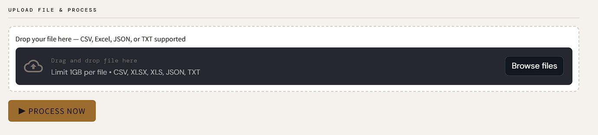
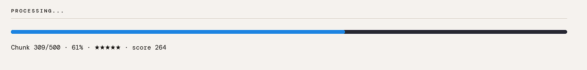
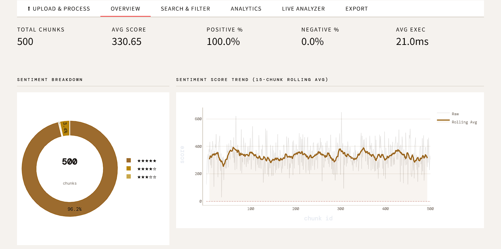
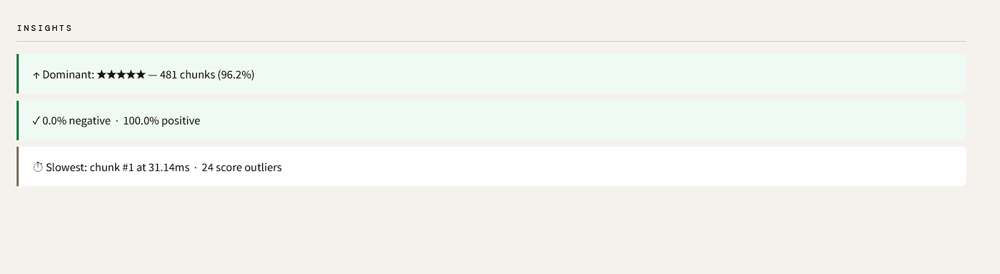
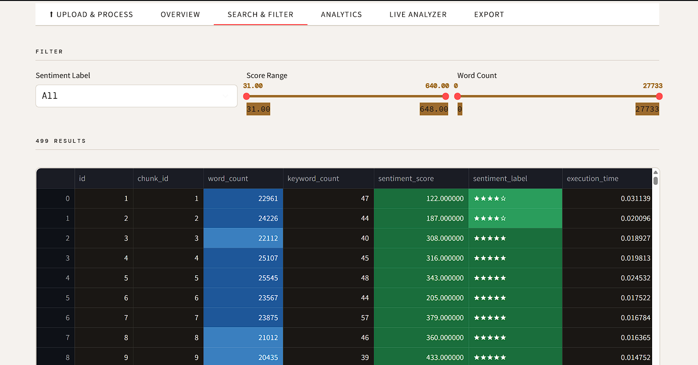
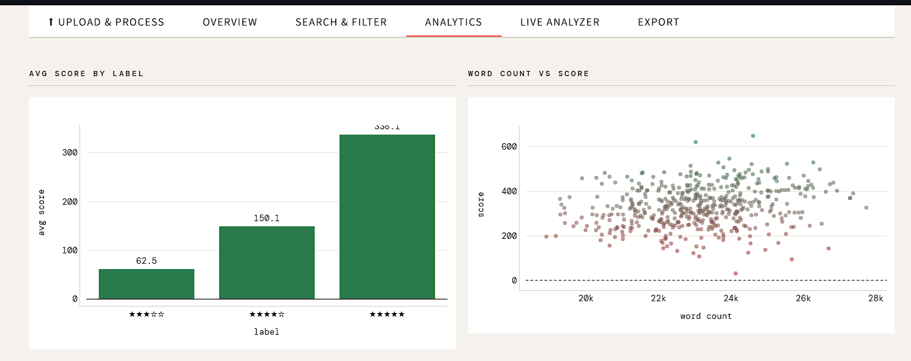
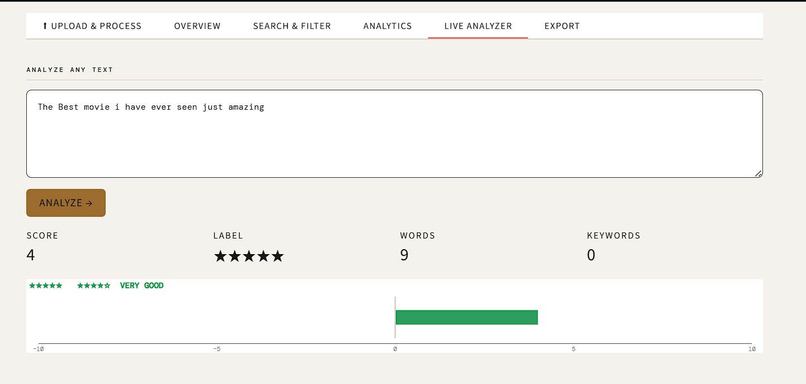
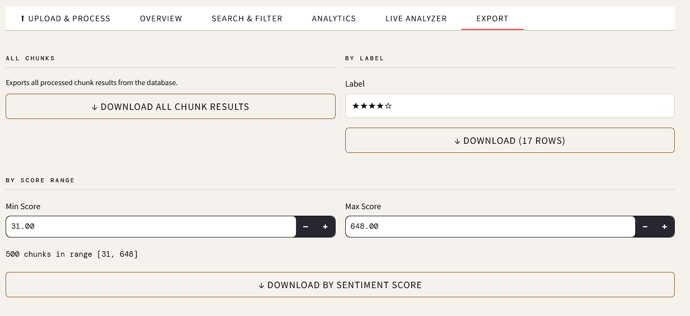
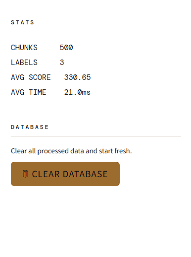

<h1 align="center">🔍 TextLens</h1>

<p align="center">
  <b>Parallel Text Processing & Sentiment Analysis Dashboard</b>
</p>

<p align="center">
  🐍 Python &nbsp;•&nbsp; ⚡ Multiprocessing &nbsp;•&nbsp; 🗄️ SQLite &nbsp;•&nbsp; 📊 Streamlit &nbsp;•&nbsp; 🔎 Rule-Based NLP
</p>

<p align="center">
  <i>Upload any text dataset → Process in parallel → Explore insights in a beautiful dashboard</i>
</p>

<p align="center">
  
  
  
  
</p>

---

## 🌟 Project Overview

**TextLens** is a scalable Python-based system that processes large text datasets — like 50,000+ IMDb movie reviews — using **parallel computing**, and displays all results in an interactive **Streamlit dashboard**.

The system performs:

✅ Parallel chunk-based processing (5 CPU workers)  
✅ Keyword detection using Regex  
✅ Rule-based sentiment analysis with negation & intensity handling  
✅ Star-rating sentiment output (★☆☆☆☆ to ★★★★★)  
✅ Execution time tracking per chunk  
✅ Structured SQLite storage with duplicate-skip logic  
✅ Multi-format file support — CSV, Excel, JSON, TXT  
✅ Interactive dashboard with search, filter, and export  

> No ML models. No data science libraries. Just Python, rules, and speed.

---

## ⚡ Tech Stack

| Layer | Technology |
|-------|-----------|
| Language | Python 3.x |
| Parallel Processing | `multiprocessing.Pool` (5 workers) |
| Sentiment Engine | Custom Rule-Based NLP |
| Database | SQLite (`chunks.db`) |
| Dashboard | Streamlit |
| Charts | Plotly |
| Text Matching | Regex |
| File Support | CSV, Excel (.xlsx/.xls), JSON, TXT |

---

## 🧠 Internal Processing Pipeline

```
           Dataset (.csv / .xlsx / .json / .txt)
                           │
                           ▼
               ┌───────────────────────┐
               │   Silent File Convert  │
               │  (any format → list)   │
               └───────────────────────┘
                           │
                           ▼
               ┌───────────────────────┐
               │    Dynamic Chunking    │
               │   (100 reviews/chunk)  │
               └───────────────────────┘
                           │
                           ▼
               ┌───────────────────────┐
               │  Multiprocessing Pool  │
               │       (5 CPUs)         │
               └───────────────────────┘
                  │        │        │
                  ▼        ▼        ▼
             Chunk 1   Chunk 2  ...Chunk N
                  │
                  ▼
       ┌─────────────────────────┐
       │      Rule Engine         │
       │  • Word Count            │
       │  • Keyword Detection     │
       │  • Sentiment Score       │
       │  • Negation Handling     │
       │  • Intensity Detection   │
       │  • Star Rating           │
       │  • Execution Time        │
       └─────────────────────────┘
                  │
                  ▼
          SQLite Database
            chunks.db
         (duplicate-skip)
```

---

## 🖥️ UI Pipeline (Dashboard Flow)

```
  File Upload (CSV / Excel / JSON / TXT)
              │
              ▼
    Auto Format Detection
    & Silent Conversion
              │
              ▼
    Chunk Creation (100/chunk)
              │
              ▼
    Rule Engine Processing
    (with real-time progress bar)
              │
              ▼
    SQLite Storage
    (skips duplicates automatically)
              │
              ▼
    ┌─────────────────────────────────┐
    │        Streamlit Dashboard       │
    │                                  │
    │  Overview → Search → Analytics   │
    │  Live Analyzer → Export          │
    └─────────────────────────────────┘
```

---

## ✨ Features

### 🔄 Processing
- Upload any file directly from browser — no terminal needed
- Silent conversion of Excel, JSON, TXT to processing pipeline
- Real-time chunk-by-chunk progress bar
- Duplicate detection — re-uploading same file skips existing chunks
- Empty file alert before processing begins

### 📊 Dashboard Tabs

| Tab | What it shows |
|-----|--------------|
| ⬆ Upload & Process | File upload, format detection, live progress |
| 📊 Overview | KPI cards, donut chart, trend line, exec time, insights |
| 🔍 Search & Filter | Filter by label / score / word count, colorized table |
| 📈 Analytics | Avg score by rating, word count vs score scatter |
| 💬 Live Analyzer | Paste any text → instant sentiment + score bar |
| 📤 Export | Download by label, score range, or all data |

### 🧠 Sentiment Engine
- 50+ weighted sentiment words across 7 tiers
- Negation window (3-word lookback) — `not at all good` → negative
- Intensity multipliers — `very good` → 2x score
- Density normalization — score per 1000 words (chunk-size independent)

### 🗄️ Database
- SQLite with duplicate-skip on re-process
- Clear Database option (resets all data + IDs)
- Live stats in sidebar

---

## 📸 Dashboard Preview

### ⬆ Upload & Process


### ⚙️ Processing in Progress


### 📊 Overview


### 💡 Insights


### 🔍 Search & Filter


### 🔎 Keyword Search


### 📈 Analytics


### 💬 Live Analyzer


### 📤 Export (Multiple Filters)


### 🗂️ Sidebar


---

## 🔑 Sentiment Engine Details

### Star Rating System

| Stars | Density Score | Example Words |
|-------|--------------|---------------|
| ★★★★★ | ≥ 8.0 | masterpiece, flawless, phenomenal |
| ★★★★☆ | ≥ 4.0 | outstanding, brilliant, exceptional |
| ★★★☆☆ | ≥ 1.0 | amazing, fantastic, delightful |
| ★★☆☆☆ | ≥ -3.0 | bad, boring, mediocre |
| ★☆☆☆☆ | < -3.0 | terrible, worst, abysmal |

### Negation Handling
```python
NEGATIONS = {"not", "never", "no", "neither", "nor", "hardly", "barely"}

# not good  → negative
# not bad   → positive
# Window:   3 words before the sentiment word
```

### Intensity Handling
```python
INTENSIFIERS = {"very", "extremely", "really", "absolutely", "incredibly"}

# very good     → score × 2
# extremely bad → score × 2 (negative direction)
```

---

## 🗄️ Database Schema

**Database:** `chunks.db` | **Table:** `chunk_results`

| Column | Type | Description |
|--------|------|-------------|
| id | INTEGER | Auto-increment primary key |
| chunk_id | INTEGER UNIQUE | Chunk sequence number |
| word_count | INTEGER | Total words in chunk |
| keyword_count | INTEGER | Matched keyword count |
| sentiment_score | REAL | Raw sentiment score |
| sentiment_label | TEXT | Star rating (★★★★★) |
| execution_time | REAL | Processing time in seconds |

---

## 🏗️ Project Structure

```
text_handler_pro/
│
├── app.py               # Streamlit dashboard (standalone — recommended)
├── main.py              # Terminal entry point
├── processor.py         # Parallel chunk processing
├── rule_engine.py       # Sentiment & rule evaluation
├── database.py          # Database setup & management
├── chunks.py            # Chunking logic
├── search.py            # Terminal search & export CLI
├── chunks.db            # Result database (auto-created)
├── imdb.csv             # Source dataset
├── .streamlit/
│   └── config.toml      # 1GB upload limit
├── screenshots/         # Dashboard screenshots for README
└── README.md
```

---

## ▶️ How To Run

### 🖥️ Dashboard — Recommended

```bash
# Install dependencies
pip install streamlit plotly pandas openpyxl

# Run dashboard
streamlit run app.py
```

Then open `http://localhost:8501` and upload your file in the **Upload & Process** tab.

### 💻 Terminal (Original Pipeline)

```bash
# Run terminal processor
python main.py
```

**Terminal menu:**
```
1. Process    → chunk & analyze imdb.csv
2. Search     → filter / keyword search / export
3. Exit
```

---

## ⚡ Parallel Processing

```python
from multiprocessing import Pool

with Pool(5) as pool:
    pool.map(process_chunk, [(i+1, chunk) for i, chunk in enumerate(chunks)])
```

**Benefits:**
- Utilizes 5 CPU cores simultaneously
- Each chunk processed independently
- ~5x faster than sequential processing
- Scalable — works for 1K to 1M+ rows

---

## 🧩 Milestone Progress

### ✅ Milestone 1 — Core Pipeline
- Chunk-based processing architecture
- Regex keyword detection
- SQLite database integration
- Initial multiprocessing implementation (4 workers)

### ✅ Milestone 2 — Full System
- Real IMDb dataset (50K reviews)
- Rule engine with negation & intensity
- Star-rating sentiment output
- CPU workers upgraded (4 → 5)
- Duplicate-skip logic
- Modular architecture

### ✅ Milestone 3 — Dashboard & Extensions
- Full Streamlit dashboard (6 tabs)
- Multi-format file support (CSV, Excel, JSON, TXT)
- Real-time processing progress bar
- Colorized interactive data table
- Live text analyzer
- CSV export with UTF-8 BOM (Excel-compatible)
- Terminal search CLI (`search.py`)
- Clear database with ID reset
- 1GB upload limit configuration

---

## 🧠 Key Concepts

| Concept | How it's used here |
|---------|-------------------|
| Parallel Computing | `multiprocessing.Pool` splits chunks across 5 CPU workers |
| Rule-Based NLP | Weighted word dictionary + negation + intensity logic |
| Data Chunking | Dataset split into equal parts for parallel processing |
| Density Normalization | Score ÷ word_count × 1000 — fair rating across chunk sizes |
| Duplicate Detection | `chunk_id UNIQUE` constraint + skip logic in insert |
| File Abstraction | Single pipeline handles CSV, Excel, JSON, TXT silently |
| SQLite Integration | Lightweight embedded DB, no server required |

---

## 👨‍💻 Built With

- Python 3.x
- Streamlit
- Plotly
- SQLite (built-in)
- Pandas + OpenPyXL
- VS Code
- IMDb Movie Reviews Dataset

---

<p align="center">
  ⭐ &nbsp; Efficient &nbsp;•&nbsp; Parallel &nbsp;•&nbsp; Intelligent &nbsp;•&nbsp; Scalable &nbsp; ⭐
</p>
